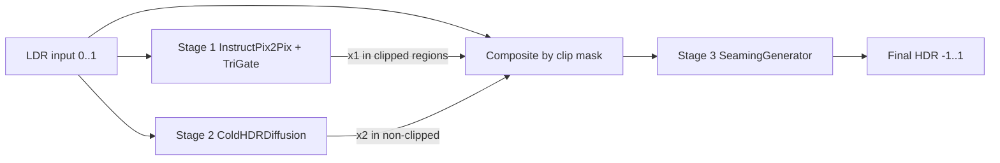
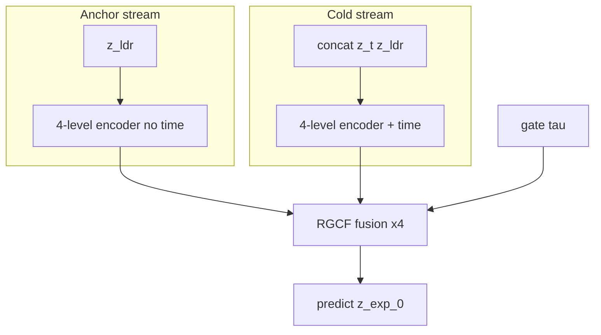

# TriGate-HDR: Model Architecture & Implementation

This document is the **authoritative architecture reference** for the TriGate-HDR repository. It describes **philosophy**, **mathematics**, **tensor flows**, **skip connections**, **training objectives**, and **how Stages 1–3 connect in code**—from the foundational diffusion path (Stage 1) through cold diffusion (Stage 2) to the seaming WGAN (Stage 3).

**Primary code roots:** `TriGate-HDR/model/`

---

## Table of contents

1. [Problem statement and design philosophy](#1-problem-statement-and-design-philosophy)
2. [End-to-end pipeline](#2-end-to-end-pipeline)
3. [Data representation and gating](#3-data-representation-and-gating)
4. [Stage 1 — Foundational diffusion (InstructPix2Pix + TriGate)](#4-stage-1--foundational-diffusion-instructpix2pix--trigate)
5. [Stage 2 — ColdEfficient-LORCD (latent cold diffusion)](#5-stage-2--coldefficient-lorcd-latent-cold-diffusion)
6. [Stage 3 — Composition and seaming WGAN](#6-stage-3--composition-and-seaming-wgan)
7. [Loss functions (all stages)](#7-loss-functions-all-stages)
8. [SAM masks and segmentation conditioning](#8-sam-masks-and-segmentation-conditioning)
9. [Training scripts, checkpoints, and metrics](#9-training-scripts-checkpoints-and-metrics)
10. [Gradient and freezing policy](#10-gradient-and-freezing-policy)
11. [Legacy and alternate paths](#11-legacy-and-alternate-paths)
12. [Repository map](#12-repository-map)

---

## 1. Problem statement and design philosophy

### 1.1 The HDR-from-LDR tension

A single LDR exposure is an **incomplete observation** of scene radiance:

- In **well-exposed** regions, recovery is closer to **deterministic inversion** (tone curve / radiometric model).
- In **saturated (clipped)** regions, many HDR radiances map to the same LDR value—the inverse problem is **ill-posed**. Pixel-wise MSE tends to **blur highlights** or produce **ungrounded hallucinations**.

### 1.2 Why three stages instead of one network

TriGate-HDR **does not force one loss to solve both regimes**. It uses three complementary generators:

| Stage | Generative bias | “Noise” or corruption | Pretrained foundation? | Encoders |
|-------|-----------------|------------------------|-------------------------|----------|
| **1** | Strong conditioned **latent diffusion** (hallucination-capable, scene-grounded) | Gaussian ε in VAE latent space | **Yes** — `timbrooks/instruct-pix2pix` | **Yes** — material, structural, semantic, mask |
| **2** | **Cold diffusion** — radiometric expansion from LDR | **Deterministic cold on expansion latent** | **No** — train from scratch | **No** (mini VAE only) |
| **3** | **Seaming GAN** — local realism at paste boundaries | N/A (refinement only) | **No** | **No** |

**Philosophical metaphor (TriGate):** three “gates” route **where** and **how** HDR is recovered, then Stage 3 **seams** two model opinions without repainting the whole frame.

### 1.3 Cold diffusion vs warm (Gaussian) diffusion

**Warm diffusion (Stage 1):**  
\(x_t = \sqrt{\bar\alpha_t}\, x_0 + \sqrt{1-\bar\alpha_t}\,\epsilon\) with \(\epsilon \sim \mathcal{N}(0, I)\). Structure is destroyed gradually in a stochastic sense; the model learns to denoise in **latent space** with heavy pretrained priors.

**Cold diffusion (Stage 2):**  
Forward corruption is **deterministic** and **physically motivated**: the observation (LDR) is the “cold” boundary state. High dynamic range collapses toward display-referred values as \(t\) increases:

\[
x_t = (1 - \alpha_t)\, x_{\mathrm{HDR}} + \alpha_t\, x_{\mathrm{LDR}},
\quad \alpha_t \in [0,1],\ \alpha_0 \approx 0,\ \alpha_{T-1} \approx 1.
\]

No Gaussian noise is added; **semantic structure from LDR is preserved in the corruption path** because the forward map is a **blend toward the actual measurement**, not i.i.d. noise.

**Why no foundation model for Stage 2:** There is no public checkpoint for “LDR-blend cold HDR UNet.” Stage 2 is a **smaller, dedicated** radiometric inverter trained on paired HDR-Real data. Stage 1 already supplies the **hallucination prior**; Stage 2 supplies **global tone-consistent expansion**.

---

## 2. End-to-end pipeline

### 2.1 Inference flow (conceptual)



### 2.2 Composition (before GAN)

Let \(g\) be the **non-clipped** gate (see §3). Clip mask \(m_{\mathrm{clip}} = 1 - g\).

\[
x_{\mathrm{composed}} = (1 - m_{\mathrm{clip}}) \odot x^{(2)} + m_{\mathrm{clip}} \odot x^{(1)}.
\]

- \(x^{(2)}\): Stage 2 `restore_hdr(ldr)` — cold path (faithful global structure).
- \(x^{(1)}\): Stage 1 HDR hypothesis in **clipped** regions (hallucination path).

**Code:** `training_scripts/val_export.py` → `_build_composited_input`, `make_stage3_predictor`.

### 2.3 Seam mask morphology

A **band** around clip boundaries is where paste artifacts appear (halos, texture mismatch):

\[
m_{\mathrm{seam}} = \mathrm{clip}\big(\mathrm{dilate}(m_{\mathrm{clip}}) - \mathrm{erode}(m_{\mathrm{clip}})\big) \;\vee\; m_{\mathrm{clip}}.
\]

Implementation uses max-pool as dilate/erode (kernels 17 and 9). **Code:** `train_stage3_seaming_gan.py` → `build_composited_input`.

### 2.4 Stage 3 output

\[
x_{\mathrm{out}} = x_{\mathrm{composed}} + m_{\mathrm{seam}} \odot \Delta_\theta(x_{\mathrm{composed}}, x^{(1)}, m_{\mathrm{seam}}).
\]

Only the seam neighborhood receives learned residual \(\Delta\); outside the mask the composed image is **locked** (plus outside-lock loss during training).

---

## 3. Data representation and gating

### 3.1 Dataset (`training_scripts/data_loader.py`)

| Tensor | Range | Meaning |
|--------|-------|---------|
| `ldr_image` | \([0,1]\) | Display-referred RGB |
| `hdr_image` | \([-1,1]\) | Per-image max-normalized HDR, then \(2x-1\) |
| `gate` | \(\{0,1\}\) | \(g = \mathbf{1}[\max_c \mathrm{LDR}_c < 0.98]\) |
| `segmap` | 3×H×W | SAM semantic map + edge + class presence |
| `sam_class_masks` | C×H×W | Per-class binary masks from `.npz` |

**Note for paper comparison:** FHDR’s `data_loader.py` uses raw `.hdr` + `Normalize(0.5,0.5)` without per-image max normalization. TriGate uses **per-image max norm** for stability. **Metrics** (PSNR-μ, SSIM) follow `FHDR/test.py` on the tensors produced by TriGate’s loader—compare experiments consistently.

### 3.2 Gate semantics

- \(g_{u} \approx 1\): pixel \(u\) is **not** saturated → Stage 2 path trusted in composition.
- \(g_{u} \approx 0\): **clipped** → Stage 1 paste dominates; W1 in Stage 3 targets \((1-g)\) regions.

---

## 4. Stage 1 — Foundational diffusion (InstructPix2Pix + TriGate)

**Package:** `model/instructpix2pix_pretrained_finetuned_stage1/`  
**Trainer:** `training_scripts/train_stage1_instruct_finetune.py`  
**Class:** `TrainableTriGateInstructPix2PixStage1`

This is the **production Stage 1** path: pretrained **InstructPix2Pix** UNet in **VAE latent space**, plus **TriGate** conditioning injected into **image latents** before channel concatenation.

### 4.1 Why a foundation model

Latent diffusion at 512×512 is **not trained from scratch** in this project:

- VAE (`AutoencoderKL`) — **frozen**
- CLIP text encoder — **frozen**, fixed instruction prompt
- UNet — **pretrained** + **LoRA** adapters on attention projections (`to_q`, `to_k`, `to_v`, `to_out.0`)

Trainable TriGate components: `LatentCondInjector` (encoders + fusion).

### 4.2 Forward pass (training)

**Inputs:** LDR \(x_{\mathrm{ldr}}\in[0,1]^{3\times H\times W}\), HDR \(x_{\mathrm{hdr}}\in[-1,1]^{3\times H\times W}\), optional `segmap`, `sam_class_masks`.

1. **Text conditioning**  
   Fixed prompt (HDR recovery instruction) → CLIP `encoder_hidden_states`.

2. **VAE encode**  
   - \(z_{\mathrm{hdr}} = \mathrm{Enc}(x_{\mathrm{hdr}})\) (sampled)  
   - \(z_{\mathrm{img}} = \mathrm{Enc}(2x_{\mathrm{ldr}}-1)\) (mode)

3. **Gaussian diffusion on HDR latents**  
   Sample \(t\), \(\epsilon \sim \mathcal{N}(0,I)\):  
   \(z_t = \mathrm{add\_noise}(z_{\mathrm{hdr}}, \epsilon, t)\).

4. **TriGate latent conditioning** (`LatentCondInjector`)  
   \(z_{\mathrm{img}}' = z_{\mathrm{img}} + \sigma_{\mathrm{res}} \cdot \Delta(z_{\mathrm{img}}, t, \text{encoders}(x_{\mathrm{ldr}}))\)  
   with learnable scalar \(\sigma_{\mathrm{res}}\) init 0.1.

5. **InstructPix2Pix UNet**  
   Input channels: `concat([z_t, z_img'], dim=1)` (typically 4+4=8).  
   Predict \(\hat\epsilon = \mathrm{UNet}(\cdot)\).

6. **Primary loss**  
   \(\mathcal{L}_{\mathrm{diff}} = \|\hat\epsilon - \epsilon\|_2^2\).

7. **Novelty ramp (optional)**  
   After warm-up epochs, decode \(\hat x_0\) from \((z_t,\hat\epsilon)\), VAE decode → RGB HDR, add **W1 + SFL + KL** (see §7).

### 4.3 `LatentCondInjector` architecture

**File:** `latent_cond_injector.py`

```
ldr, segmap
    │
    ▼
TriEncoderBundle ──► mat_feat, struct_feat, gate, sem_feats[0..3], mask_feats[0..3], class_probs, aux
    │
    ▼
HorizontalTriStreamFusion (at latent resolution, sem_feats[3], mask_feats[3])
    │
    ▼
delta [B,4,h,w]  ──►  image_latents + res_scale * delta
```

**No UNet skip connections here** — fusion is a **single-scale residual on 4-channel latents** (spatial size = VAE latent grid).

### 4.4 TriEncoderBundle (three encoders + mask)

**File:** `tri_encoder_bundle.py` (reuses blocks from `dual_decoders/`)

| Module | Role | Output used in Stage 1 Instruct |
|--------|------|--------------------------------|
| `RuntimeMaskPredictor` | LDR → soft 3-ch pseudo-seg if SAM missing | Blended into `segmap` |
| `SegMaskEncoder` | Multi-scale mask pyramid | `mask_feats[0..3]` |
| `material_encoder` | Material / texture cues | `mat_feat` (523 ch) |
| `structural_encoder` | Structure + **gate** \(g\) | `struct_feat` (256 ch) |
| `semantic_codebook_encoder` | VAE-style latents + KL | `sem_feats`, `mus`, `logvars` |

### 4.5 HorizontalTriStreamFusion (encoder fusion core)

**File:** `dual_decoders/cold_hdr_luminance_diffusion_decoder.py`

**Philosophy:** Material stream **queries** structure and semantics via low-res attention (VRAM-safe), then **time-gated** mixing with mask stream.

Per spatial level (Stage 1 Instruct uses **deepest** semantic/mask level only at latent resolution):

1. Project material, structural, semantic, mask to `target_ch` (4 for latent injector).
2. Pool to ≤ `attn_max_tokens` (default 1024) for attention.
3.  
   \(\mathrm{Attn}_S = \mathrm{softmax}(Q_M K_S^\top / \sqrt{C}) V_S\),  
   \(\mathrm{Attn}_Z = \mathrm{softmax}(Q_M K_Z^\top / \sqrt{C}) V_Z\).
4. Timestep gates \(\gamma_k = \sigma(W_k t_{\mathrm{emb}})\), \(k \in \{1,2,3,4\}\):
   \[
   \mathrm{fused} = [\gamma_1 \tilde M,\; \gamma_2 \mathrm{Attn}_S,\; \gamma_3 \mathrm{Attn}_Z,\; \gamma_4 \tilde R]
   \]
5. \(x \leftarrow x + \mathrm{Conv}_{1\times1}(\mathrm{fused})\).

### 4.6 InstructPix2Pix UNet (pretrained + LoRA)

**Not redesigned** — standard diffusers UNet with:

- **Input:** noisy HDR latents ∥ conditioned image latents  
- **Conditioning:** CLIP cross-attention  
- **Trainable:** LoRA weights only (phase 1), then LoRA + `LatentCondInjector` (phase 2+)

**Skip connections:** internal diffusers UNet encoder–decoder skips (resnet + attn blocks) — **unchanged** from InstructPix2Pix.

### 4.7 Inference `restore_hdr`

**File:** `trainable_stage1_system.py`

- Resize LDR (max side 768), encode LDR → `image_latents`, inject TriGate each step.  
- DDPM/scheduler loop: predict noise, `scheduler.step`, repeat.  
- VAE decode → clamp \([-1,1]\).

**Trainer validation:** `make_stage1_instruct_predictor` in `val_export.py`.

### 4.8 Training curriculum

| Phase | Epochs (typical) | Trainable |
|-------|------------------|-----------|
| Diffusion-only | `diffusion_only_epochs` (default 5) | LoRA only |
| + Novelty | ramp over `novelty_ramp_epochs` | LoRA + encoders; VAE decode for W1/SFL/KL |

---

## 5. Stage 2 — ColdEfficient-LORCD (latent cold diffusion)

**Files:**
- `model/decoders/cold_hdr_diffusion_decoder.py` — orchestrator (`ColdHDRDiffusion`)
- `model/decoders/mini_hdr_vae.py` — `MiniHDRVAE`, `MonoLiftLatent`
- `model/decoders/cold_efficient_blocks.py` — `ColdEfficientLatentUNet`, `RGCFBlock`

**Trainer:** `training_scripts/train_stage2_crf_recovery.py`  
**Class:** `ColdHDRDiffusion` + `ColdEfficientLatentUNet`

**No TriGate encoders. No pretrained SD/CLIP. Trained from scratch** (mini VAE + latent UNet).

### 5.1 Design philosophy

Stage 2 inverts **deterministic cold corruption** in **latent space**. The LDR image is encoded to a **measurement anchor** \(z_{\mathrm{LDR}}\); cold diffusion operates only on an **expansion latent** \(z^E\) that captures ill-posed HDR content beyond the observable LDR manifold. At \(t=T-1\), expansion is zero and the state equals a **monotone lift** of LDR—not raw pixel blend.

This differs from Stage 1 (Gaussian ε in pretrained VAE latent) and from LEDiff/LatentHDR (pretrained SD, exposure brackets, Gaussian noise).

### 5.2 Mathematical model

**LDR in HDR space:** \(x_{\mathrm{LDR}}^{\mathrm{hdr}} = 2 x_{\mathrm{ldr}} - 1\).

**Encode:** \(z_{\mathrm{HDR}} = E(x_{\mathrm{HDR}})\), \(z_{\mathrm{LDR}} = E(x_{\mathrm{LDR}}^{\mathrm{hdr}})\) via `MiniHDRVAE`.

**Latent radiance decomposition:**

\[
z^{\mathrm{lift}} = \mathrm{MonoLift}(z_{\mathrm{LDR}}), \qquad z^E_0 = z_{\mathrm{HDR}} - z^{\mathrm{lift}}.
\]

**Expansion-only cold forward** (schedule \(\alpha_t = t/(T-1)\)):

\[
z^E_t = (1 - \alpha_t)\, z^E_0, \qquad z_t = z^{\mathrm{lift}} + z^E_t.
\]

**Scale-adaptive cold** at UNet level \(\ell\):

\[
\alpha_{t,\ell} = \min\!\left(1,\; \alpha_t \cdot 2^{\ell-L}\right).
\]

**Network:** predicts \(\hat z^E_0 = f_\theta(z_t, z_{\mathrm{LDR}}, t, \tau)\) where \(\tau\) is the dataset **gate** (trust mask: 1 = well-exposed).

**Decode:** \(\hat x_{\mathrm{HDR}} = D(z^{\mathrm{lift}} + \hat z^E_0)\).

### 5.3 Training losses

| Loss | Role |
|------|------|
| \(\mathcal{L}_{\mathrm{vae}}\) | L1 recon + KL on HDR (and LDR cycle) |
| \(\mathcal{L}_{\mathrm{HDR}}\) | \(\|x_{\mathrm{HDR}} - D(z^{\mathrm{lift}}+\hat z^E_0)\|_1\) |
| \(\mathcal{L}_{\mathrm{exp}}\) | \(\|z^E_0 - \hat z^E_0\|_1\) |
| \(\mathcal{L}_{\mathrm{cold}}\) | \(\|\mathrm{ColdFwd}(\hat z^E_0,t) - z^E_t\|_1\) |
| \(\mathcal{L}_{\mathrm{trust}}\) | \(\|\tau \odot \hat z^E_0\|_1\) (zero expansion where LDR is trusted) |
| \(\mathcal{L}_{\mathrm{ms}}\) | Multi-scale cold consistency at UNet down levels 1–3 |
| \(\mathcal{L}_{\mathrm{mono}}\) | Monotonicity penalty on `MonoLiftLatent` |
| \(\mathcal{L}_{\mathrm{rad}}\) | `HybridRadiometricConsistencyLoss` |

**VAE warmup:** epochs \(1 \ldots N_{\mathrm{warmup}}\) train \(\mathcal{L}_{\mathrm{vae}}\) only (default \(N_{\mathrm{warmup}}=5\)).

### 5.4 Reverse sampling (`restore_hdr`)

Start \(z^E \leftarrow 0\), \(z^{\mathrm{lift}} \leftarrow \mathrm{MonoLift}(z_{\mathrm{LDR}})\). Reverse uses `inference_timesteps` (default 25) subsampled from training \(T\) to save VRAM at validation. For \(t = T-1 \ldots 0\):

1. \(z_t \leftarrow z^{\mathrm{lift}} + z^E\)
2. \(\hat z^E_0 \leftarrow f_\theta(z_t, z_{\mathrm{LDR}}, t, \tau)\)
3. **Algorithm 2** on expansion: \(z^E \leftarrow z^E - \mathrm{ColdFwd}(\hat z^E_0,t) + \mathrm{ColdFwd}(\hat z^E_0,t-1)\) (or \(\hat z^E_0\) at \(t=0\))
4. Output \(D(z^{\mathrm{lift}} + z^E)\), clamp \([-1,1]\)

### 5.5 `ColdEfficientLatentUNet` — dual streams, skips, RGCF



| Stream | Input | Timestep | Skips saved |
|--------|-------|----------|-------------|
| **Anchor** | \(z_{\mathrm{LDR}}\) | None | A1…A4 (uncorrupted) |
| **Cold** | \(\mathrm{concat}(z_t, z_{\mathrm{LDR}})\) | Sinusoidal + MLP | C1…C4 (RGCF-fused) |

**RGCF block** (`RGCFBlock`): conv cross-gate from cold+anchor (O(HW) memory; full spatial attention was removed after 12GB OOM at latent 64×64). Fused as  
\(C \leftarrow C + (1-\tau)\,\mathrm{Gate}(\mathrm{concat}(C,A))\odot \mathrm{Proj}(A) + \tau\,\mathrm{Proj}_2(A)\).

**Skip wiring:**
- Down path: after each level, RGCF fuses cold + anchor → saved as cold skip; anchor skip saved separately.
- Lateral: cold downsampled features += 1×1 proj(anchor) before next level.
- **Mid:** `ResBlock` on cold stream, then **RGCF** with deepest anchor skip \(A_4\).
- Up path: transpose conv → RGCF with matching anchor skip → concat with cold skip → ResBlock.

**Head:** 4-channel \(\hat z^E_0\) (not full HDR latent).

### 5.6 `MiniHDRVAE`

| Component | Spec |
|-----------|------|
| Encoder | 3→[32,64,128,256] conv stack, /8 spatial, outputs \(\mu,\log\sigma\) |
| Latent | 4 channels (configurable `--latent_ch`) |
| Decoder | Symmetric upsample → 3ch Tanh |
| MLN | 3-layer conv residual on \(z_{\mathrm{LDR}}\) with monotonicity penalty |

### 5.7 Novelty vs SOTA

| Idea | Cold Diffusion | LEDiff / LatentHDR | Bracket Diff | **ColdEfficient-LORCD** |
|------|----------------|--------------------|--------------|-------------------------|
| Pretrained VAE/SD | — | Yes | Yes | **No (scratch mini VAE)** |
| Gaussian ε noise | No | Yes | Yes | **No (cold expansion)** |
| Exposure brackets | — | Yes | Yes | **No (single expansion field)** |
| LDR anchor stream + RGCF | — | Partial concat | Multi-DDPM | **Dual-stream + trust gate** |
| Expansion-only cold | — | — | — | **Yes** |
| Scale-adaptive cold | — | — | — | **Yes** |

Individual components echo prior work (SingleHDR decomposition, IP2P concat conditioning, Bansal cold sampling), but this **integrated latent cold-efficient formulation for LDR→HDR without pretrained diffusion** is the Stage 2 contribution.

---

## 6. Stage 3 — Composition and seaming WGAN

**Package:** `model/seaming_model/`  
**Trainer:** `training_scripts/train_stage3_seaming_gan.py`  
**Class:** `SeamingGANSystem` = `SeamingGenerator` + `SeamingDiscriminator`

Stage 1 and Stage 2 are **frozen** during Stage 3 training; only the seaming GAN trains.

### 6.1 Inputs to the generator

| Tensor | Channels | Role |
|--------|----------|------|
| `base_hdr_x` | 3 | Composed HDR \(x_{\mathrm{composed}}\) |
| `generated_clip_hdr` | 3 | Stage 1 output \(x^{(1)}\) (clip hypothesis) |
| `seam_mask` | 1 | \(m_{\mathrm{seam}}\) |

**Stem:** `Conv2d(7 → base_ch)` on `cat([base, clip, mask], dim=1)`.

### 6.2 `SeamGatedBlock` (×6)

Each block:

1. `conv1` → LeakyReLU  
2. **Mask gate:** `sigmoid(Conv1x1(seam_mask))` broadcast multiply on features  
3. **Self-attention** on flattened spatial tokens: \(Q,K,V\) from `conv1` features, softmax attention, residual  
4. `conv2` → residual add to input: `x + gate * h`

**Philosophy:** Attention propagates **context across the seam band**; mask gate restricts **where** updates are allowed to originate.

### 6.3 Generator output (hard localization)

\[
x_{\mathrm{out}} = x_{\mathrm{composed}} + m_{\mathrm{seam}} \odot \mathrm{tail}(x),
\]

`tail`: Conv stack → 3-channel residual. **Only seam pixels** change.

### 6.4 Discriminator — dual heads

**File:** `discriminator.py`

| Head | Input | Architecture |
|------|-------|----------------|
| `global_head` | RGB (3) | 4× stride-2 conv + InstanceNorm + 1×1 conv → 1-channel map |
| `seam_head` | RGB∥mask (4) | Same stack |

Returns `(global_score, seam_score)` logit maps (PatchGAN-style).

### 6.5 GAN objectives

**Hinge (class `SeamingGANSystem`):**

\[
\mathcal{L}_D = \mathbb{E}[\max(0,1-D(x_{\mathrm{real}}))] + \mathbb{E}[\max(0,1+D(x_{\mathrm{fake}}))],
\]
\[
\mathcal{L}_G^{\mathrm{hinge}} = -\mathbb{E}[D(x_{\mathrm{fake}})].
\]

Applied to **both** global and seam heads.

**Outside lock** (training script):

\[
\mathcal{L}_{\mathrm{outside}} = \mathbb{E}\big[ |(1 - m_{\mathrm{seam}}) \odot (x_{\mathrm{out}} - x_{\mathrm{composed}})| \big].
\]

**Reconstruction mix (`stage3_loss`):** gated L2, W1 on \((1-g)\), SFL, MCL, SGCL — see §7.

### 6.6 Stage 3 full forward (training / val)

**Code:** `make_stage3_predictor` in `val_export.py`:

1. `gate` from batch (structural encoder path on LDR in legacy Stage1; dataloader provides `gate`).  
2. `gen_clip` = Stage 1 forward at \(t=0\).  
3. `stage2_hdr` = `ColdHDRDiffusion.restore_hdr(ldr)`.  
4. `composed, seam_mask` = `_build_composited_input`.  
5. `fake` = `SeamingGenerator(composed, gen_clip, seam_mask)`.

---

## 7. Loss functions (all stages)

### 7.1 Stage 1 (InstructPix2Pix path)

| Symbol | Name | Formula / idea | When |
|--------|------|----------------|------|
| \(\mathcal{L}_{\mathrm{diff}}\) | ε-prediction MSE | \(\|\hat\epsilon - \epsilon\|^2\) | Always |
| \(\mathcal{L}_{\mathrm{W1}}\) | Wasserstein-1 on histograms | Per SAM class, CDF L1 | Novelty ramp |
| \(\mathcal{L}_{\mathrm{SFL}}\) | Structural fidelity | Sobel edge L1 | Novelty ramp |
| \(\mathcal{L}_{\mathrm{KL}}\) | Codebook KL | \(D_{KL}(q(z|x)\| \mathcal{N}(0,I))\) | Novelty ramp |

**Code:** `instructpix2pix_pretrained_finetuned_stage1/losses.py`, `losses/stage_composite_losses.py`, `losses/distribution_losses.py`.

### 7.2 Stage 2

| Term | Role |
|------|------|
| \(\mathcal{L}_{\mathrm{HDR}}\) | Anchor prediction to GT HDR |
| \(\mathcal{L}_{\mathrm{cold}}\) | Self-consistency under cold forward |
| \(\mathcal{L}_{\mathrm{radiometric}}\) | CRF cycle, log, gradient ratios, highlight rolloff |

**Code:** `losses/radiometric_losses.py` → `HybridRadiometricConsistencyLoss`.

### 7.3 Stage 3

\[
\mathcal{L}_{\mathrm{Stage3}} = \mathcal{L}_{\mathrm{gate\text{-}L2}} + \mathcal{L}_{\mathrm{W1}}^{(1-g)} + 0.2\mathcal{L}_{\mathrm{SFL}} + 0.1\mathcal{L}_{\mathrm{MCL}} + 0.3\mathcal{L}_{\mathrm{SGCL}} + \mathcal{L}_{\mathrm{GAN}} + \lambda_{\mathrm{out}}\mathcal{L}_{\mathrm{outside}}.
\]

---

## 8. SAM masks and segmentation conditioning

**Offline:** `sam_mask_generation/` produces `segmented_masks/{stem}.npz` with `semantic_map`.

**Online:** `TriGateHDRDataset` builds:

- `sam_class_masks[c]` — class \(c\) presence  
- `segmap` — `[sem_norm, edge_map, class_presence]` (3 channels)

**Stage 1 Instruct:** `segmap` feeds `TriEncoderBundle`; `sam_class_masks` feed **W1** novelty loss per class.

**Stage 2:** does **not** use SAM (radiometric pixel cold diffusion only).

**Stage 3:** `sam_class_masks` optional in `stage3_loss` for class-aware W1.

---

## 9. Training scripts, checkpoints, and metrics

### 9.1 Scripts

| Stage | Script | Default checkpoint dir |
|-------|--------|-------------------------|
| 1 | `train_stage1_instruct_finetune.py` | `experiments/stage1_instruct` |
| 2 | `train_stage2_crf_recovery.py` | `experiments/stage2_cold` |
| 3 | `train_stage3_seaming_gan.py` | `checkpoints_stage3` |

**Stage 1 features:** trial validation before epoch 1, train-probe metrics, full val every `full_val_every`, `latest.pt`, LoRA + injector phases.

**Stage 2 features:** ColdEfficient-LORCD, VAE warmup, trial validation, train-probe, full val schedule, FHDR metrics, trust-gated cold+radiometric losses.

**Stage 3:** loads frozen Stage 1 & 2 from `best.pt` / `latest.pt`; trains generator + discriminator.

### 9.2 Metrics (FHDR-aligned)

**Implementation:** `training_scripts/common_training.py`

- **PSNR-μ:** `mu_tonemap` (μ=5000) on pred/GT, MSE mean, `PSNR = 10 log10(1/MSE)` — matches `FHDR/test.py`.
- **SSIM:** `(x+1)/2` → HWC, `structural_similarity(..., channel_axis=2, data_range=1.0)` on modern skimage (legacy: `compare_ssim(..., multichannel=True)`).

**Verify:** `python -m model.training_scripts.verify_fhdr_metrics`

### 9.3 Example commands

**Stage 1** (from `TriGate-HDR/`):

```bash
export PYTHONPATH="$(pwd)"
export CUDA_VISIBLE_DEVICES=0
python -u -m model.training_scripts.train_stage1_instruct_finetune \
  --ldr_dir .../HDR-Real/LDR_in \
  --hdr_dir .../HDR-Real/HDR_gt \
  --sam_mask_dir .../segmented_masks \
  --checkpoint_dir .../experiments/stage1_instruct \
  --epochs 60 --batch_size 2 --max_dim 512
```

**Stage 2:**

```bash
python -u -m model.training_scripts.train_stage2_crf_recovery \
  --ldr_dir .../HDR-Real/LDR_in \
  --hdr_dir .../HDR-Real/HDR_gt \
  --checkpoint_dir .../experiments/stage2_cold_lorcd \
  --epochs 100 --batch_size 2 --max_dim 512 --timesteps 100 \
  --base_ch 64 --latent_ch 4 --vae_warmup_epochs 5 --amp
```

**Stage 3:**

```bash
python -u -m model.training_scripts.train_stage3_seaming_gan \
  --ldr_dir ... --hdr_dir ... \
  --stage1_ckpt_dir .../experiments/stage1_instruct \
  --stage2_ckpt_dir .../experiments/stage2_cold \
  --checkpoint_dir .../experiments/stage3_seam \
  --sam_mask_dir .../segmented_masks
```

---

## 10. Gradient and freezing policy

| Component | Stage 1 train | Stage 2 train | Stage 3 train |
|-----------|---------------|---------------|---------------|
| VAE / CLIP (Stage 1) | Frozen | — | — |
| MiniHDR-VAE (Stage 2) | — | **Trainable** | Frozen |
| Instruct UNet | LoRA only (+ injector later) | — | Frozen (if legacy Stage1) |
| TriGate encoders | Phase 2+ | — | Frozen |
| ColdHDRDiffusion | — | **All trainable** | Frozen |
| Seaming GAN | — | — | **Trainable** |

**Stage 3 note:** Production Stage 3 script still references `Stage1TriEncoderDiffusionSystem` for frozen Stage 1. For deployments trained with **InstructPix2Pix Stage 1**, update `train_stage3_seaming_gan.py` to load `TrainableTriGateInstructPix2PixStage1` and use `restore_hdr` / `make_stage1_instruct_predictor` — checkpoint keys differ (`stage1_type` in payload).

---

## 11. Legacy and alternate paths

### 11.1 Legacy Stage 1 (`dual_decoders/`)

**Class:** `Stage1TriEncoderDiffusionSystem` + `GroundedHDRUNet`

- **Pixel-space** UNet (not latent InstructPix2Pix).  
- **HorizontalTriStreamFusion at four pyramid levels** (g1–g3, gm) inside UNet skips — richer than latent injector’s single-scale fusion.  
- **Trainer:** `train_stage1_dual_diffusion.py` — not the primary path for new experiments.

**GroundedHDRUNet skip topology:** same 3-level down/up with concat skips `(s3,s2,s1)` **plus** fusion blocks after each down/mid/up stage.

### 11.2 Luminance Gaussian diffusion (`cold_hdr_luminance_diffusion_decoder.py`)

Separate module using **Gaussian noise on luminance channel** then RGB rescaling — used in research / legacy narratives, **not** Stage 2’s cold LDR blend.

### 11.3 Stable Diffusion baseline

`decoders/stable_diffusion_stage1_decoder.py` — frozen SD prior experiments; not the TriGate three-stage pipeline.

---

## 12. Repository map

```
TriGate-HDR/
├── model_architecture.md          ← this file
├── model/
│   ├── instructpix2pix_pretrained_finetuned_stage1/   # Stage 1 (production)
│   │   ├── trainable_stage1_system.py
│   │   ├── latent_cond_injector.py
│   │   ├── tri_encoder_bundle.py
│   │   └── losses.py
│   ├── decoders/
│   │   ├── cold_hdr_diffusion_decoder.py             # Stage 2 orchestrator
│   │   ├── mini_hdr_vae.py                           # MiniHDR-VAE + MLN
│   │   └── cold_efficient_blocks.py                  # Latent UNet + RGCF
│   ├── dual_decoders/
│   │   └── cold_hdr_luminance_diffusion_decoder.py   # Legacy Stage 1 UNet + fusion
│   ├── seaming_model/                                # Stage 3 GAN
│   ├── encoders/                                     # Material, struct, semantic
│   ├── losses/
│   └── training_scripts/
│       ├── train_stage1_instruct_finetune.py
│       ├── train_stage2_crf_recovery.py
│       ├── train_stage3_seaming_gan.py
│       ├── common_training.py                        # PSNR-μ, SSIM (FHDR)
│       └── val_export.py                             # Composition + predictors
└── experiments/                                      # Checkpoints, metrics CSV
```

---

## Summary table: what is novel where

| Idea | Stage | Implementation |
|------|-------|----------------|
| Pretrained latent diffusion + instruction | 1 | InstructPix2Pix + LoRA |
| Tri-stream encoder fusion | 1 | `HorizontalTriStreamFusion` + `LatentCondInjector` |
| SAM / W1 / KL novelty | 1 | `novelty_losses`, class masks |
| **Latent expansion cold diffusion** | **2** | `ColdEfficient-LORCD`, RGCF, MLN |
| **No foundation model** | **2** | Train `MiniHDRVAE` + latent UNet from scratch |
| **Clip-aware composition** | **3** | `_build_composited_input` |
| **Seam-localized GAN** | **3** | `m_seam * residual` generator |
| Dual discriminator (global + seam) | 3 | `SeamingDiscriminator` |
| FHDR-comparable metrics | All | `compute_psnr_ssim` / `fhdr_compare_ssim` |

---

*Document version aligns with ColdEfficient-LORCD Stage 2 and InstructPix2Pix Stage 1 training path.*
